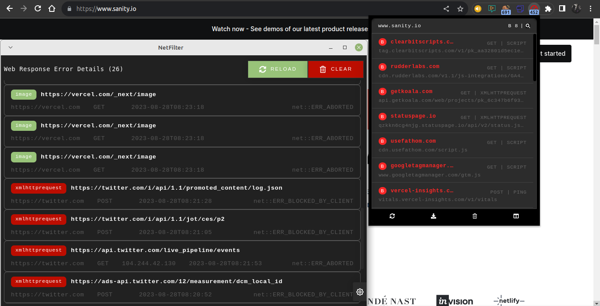

# NetFilter
Ad, Tacking, Malwares block and dashboard for developers, using declarativeNetRequest API.

# Captures

# Notes
- [Old repository](https://gitlab.com/chromo-lib/NetFilter)
- [onRuleMatchedDebug](https://developer.chrome.com/docs/extensions/reference/declarativeNetRequest/#event-onRuleMatchedDebug) Fired when a rule is matched with a request. Only available for unpacked extensions with the declarativeNetRequestFeedback permission as this is intended to be used for debugging purposes only.

# License
Apache
